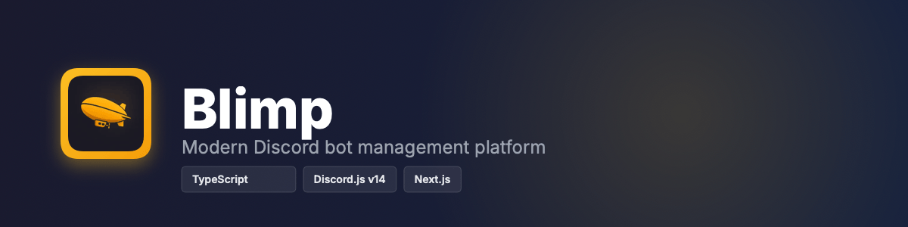

  

 

## About

Blimp is a powerful Discord bot with an intuitive web dashboard, designed to streamline server management and enhance community engagement. Built with modern technologies and a focus on user experience.

## Features

### Available Now

- 🏷️ **Tags** - Create custom commands with dynamic responses
- 👋 **Welcome & Goodbye** - Automated member greet and farewell messages
- 🔐 **Secure API** - Protected endpoints with bearer token authentication

### Coming Soon

- 🛡️ **Auto Moderation** - Intelligent content filtering and rule enforcement
- ⏱️ **Smart Slowmode** - Dynamic rate limiting based on chat activity
- ⭐ **Starboard** - Highlight the best messages in your server
- 📊 **Leveling System** - Reward active members with XP and ranks
- 🔔 **Social Notifications** - Stay updated with social media alerts
- 🎫 **Ticketing** - Professional support ticket management
- ⏰ **Reminders** - Never miss important events
- 📈 **Statistics** - Live stats channels and dashboard insights
- 🔊 **Temporary Channels** - Auto-managed voice channels
- 💰 **Economy** - Server currency and rewards system
- 🎉 **Giveaways** - Manage and automate prize distributions

## Technology Stack

- **Runtime**: [Bun](https://bun.sh)
- **Language**: TypeScript 5.0+
- **Discord Library**: Discord.js v14
- **Framework**: Next.js
- **Authentication**: Better Auth
- **Database**: PostgreSQL with Drizzle ORM

<!-- ## Getting Started

[Invite Blimp to your server](https://discord.com/api/oauth2/authorize?client_id=1372669471377850458&permissions=8&scope=bot) and visit the [dashboard](https://blimp.gg) to start configuring your bot. -->

## Contributing

Contributions are welcome! Please feel free to submit a Pull Request.

## License

This project is licensed under the Apache License 2.0 License - see the [LICENSE](LICENSE) file for details.

<!--
## Support

Need help? Join our [Discord Server](https://discord.gg/your-invite) or open an issue on GitHub. -->

---

  Built with ❤️ by the Blimp team

